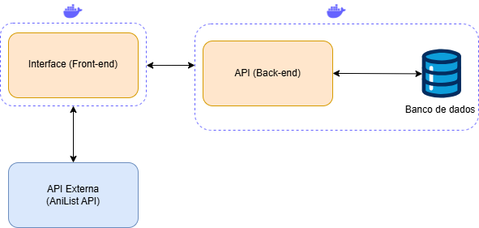

# 📺 AniMangaTracker

**AniMangaTracker** é uma aplicação web desenvolvida em React que permite aos usuários organizarem suas listas de animes e mangás de forma personalizada. Além disso, o app fornece a programação atualizada dos animes lançados ao longo do ano. Ideal para quem deseja acompanhar seus títulos favoritos e descobrir novas produções de forma prática e visual.

---

## 🚀 Tecnologias Utilizadas

Este projeto foi desenvolvido utilizando as seguintes tecnologias e versões:

- **Vite** 6.2.0 – Bundler moderno e rápido para desenvolvimento frontend.
- **React** 19.0.0 – Biblioteca para construção de interfaces declarativas.
- **Redux Toolkit** 2.6.1 – Gerenciamento de estado global de forma eficiente.
- **React Router** 7.4.0 – Roteamento de páginas de forma simples e poderosa.
- **Sass** 1.86.0 – Pré-processador CSS para organização e reaproveitamento de estilos.
- **Material UI (MUI)** 6.4.8 – Componentes de UI com design moderno e acessível.

---

## 🛠️ Pré-requisitos

Para rodar o projeto localmente, você precisa ter instalado em sua máquina:

- [Node.js](https://nodejs.org/) **versão 22.11.0**
- [npm](https://www.npmjs.com/) ou [Yarn](https://yarnpkg.com/)
- [Docker](https://www.docker.com/)

> ⚠️ O projeto **deve ser executado dentro de um container Docker** para garantir compatibilidade e isolamento de ambiente.

---

## 🚀 Instalação e Execução

### 1. Clone o repositório

```bash
git clone <URL DO REPOSITÓRIO>
cd <URL DO REPOSITÓRIO>
```
Substitua `<URL_DO_REPOSITORIO>` pela URL do repositório.

### 2. Build da imagem Docker

```bash
docker build -t animanga-tracker-frontend .
```

### 3. Rodar o container

```bash
docker run -p 3000:3000 animanga-tracker-frontend
```

A aplicação estará disponível em: [http://localhost:3000](http://localhost:3000)

💡 Para personalização do ambiente de desenvolvimento com `npm` ou `yarn`, siga os procedimentos abaixo:

### 4. Instale as dependências

Com **npm**:

```bash
npm install
```

Ou com **yarn**:

```bash
yarn
```

### 5. Execute o projeto em ambiente de desenvolvimento

```bash
npm run dev
```

---

## 📡 API Externa — AniList

O AniMangaTracker consome dados da [AniList API](https://anilist.co/), uma API pública para informações sobre animes, mangás, personagens e cronogramas.

- 📘 **Documentação oficial:** [https://docs.anilist.co](https://docs.anilist.co)
- 🔑 **Cadastro:** Não é necessário para uso básico, mas a autenticação via OAuth2 está disponível para funcionalidades avançadas.
- 📄 **Licença:** A AniList API é gratuita para uso pessoal e educacional. Consulte os [termos de uso](https://anilist.co/legal) para mais detalhes.
- 🔁 **Rotas utilizadas:** Apenas **requisições POST**, conforme especificado na documentação (GraphQL).

---

## 🧭 Arquitetura da Aplicação

Abaixo está o fluxograma da arquitetura da aplicação, que demonstra a estrutura e fluxo de dados:



---

## 📂 Estrutura de Diretórios (resumida)

```bash
src/
├── assets/            # Imagens e ícones
├── components/        # Componentes reutilizáveis
├── features/          # Módulos com estados (Redux slices)
├── pages/             # Páginas da aplicação
├── routes/            # Configurações de rotas
├── services/          # Integração com API (GraphQL e REST)
├── styles/            # Estilos globais (Sass)
└── utils/             # Funções utilitárias
```

---

## 📃 Licença

Este projeto está licenciado sob a [MIT License](LICENSE).